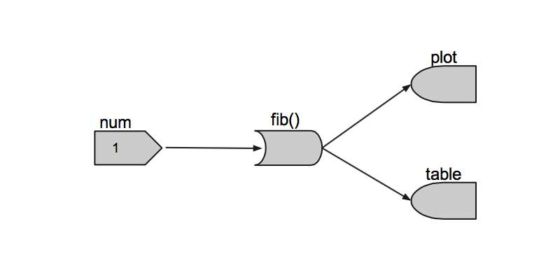
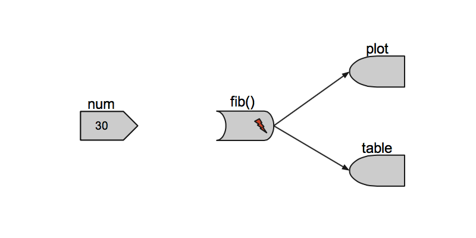
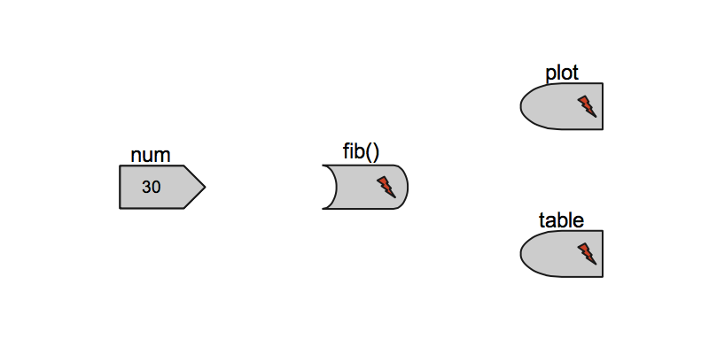
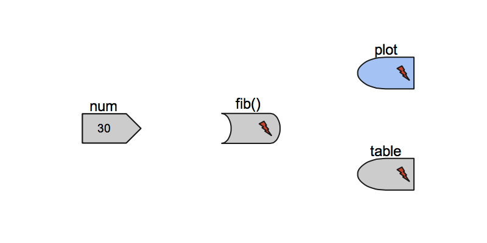
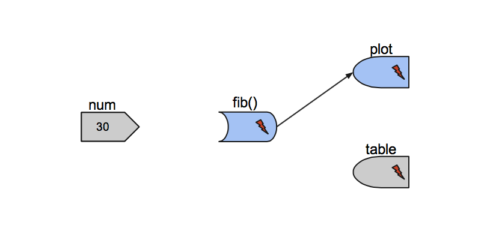
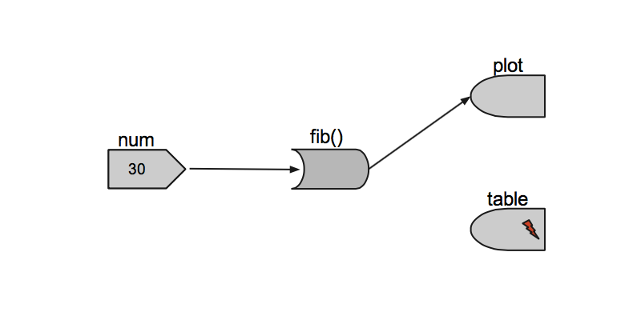
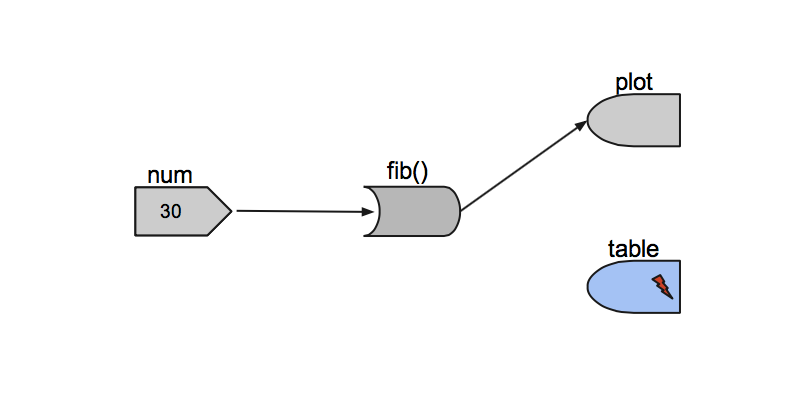
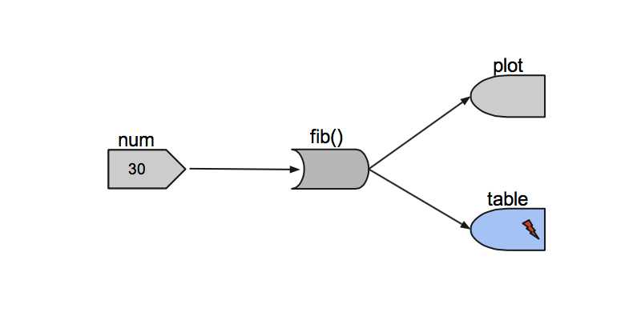
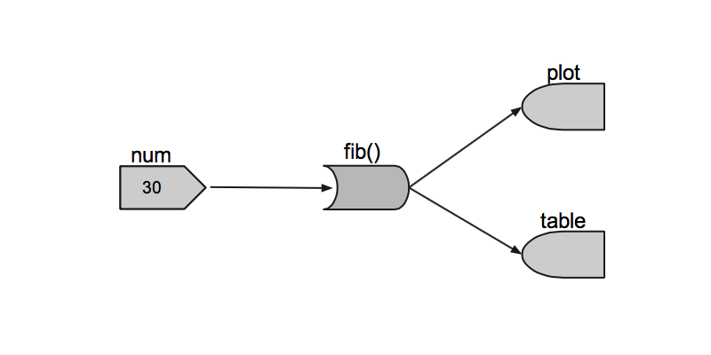

## Disclaimer

1. We are autodidacts 
2. What we present here works for us
3. Read and follow the official [Google Chart API documentation](https://developers.google.com/chart/) and [Terms of Service](https://developers.google.com/readme/terms)
4. Sometimes you have to re-load this presentation for the charts and all slides to appear

---

## Agenda

* Introduction and motivation
* Google Chart Tools
* R package googleVis
  * Concepts of googleVis
  * Case studies
* googleVis on shiny  


--- .segue .dark

## Introduction and motivation

--- .class #id 

## Hans Rosling: No more boring data

<iframe width="420" height="315" src="http://www.youtube.com/embed/hVimVzgtD6w" frameborder="0" allowfullscreen></iframe>

---

## Motivation for googleVis

* Inspired by Hans Rosling’s talks we wanted to use interactive data visualisation tools to foster the dialogue between data analysts and others

* We wanted moving bubbles charts as well

* The software behind Hans’ talk was bought by Google and integrated as motion charts into their Visualisation API

* Ideally we wanted to use R, a language we knew

* Hence, we had to create an interface between the Google Chart Tools and R

--- .segue .dark

## Google Chart Tools

---

## Introduction to Google Chart Tools

* Google Chart Tools provide a way to visualize data on web sites

* The API makes it easy to create interactive charts

* It uses JavaScript and DataTable / JSON as input

* Output is either HTML5/SVG or Flash

* Browser with internet connection required to display chart

* Please read the Google [Terms of Service](https://developers.google.com/terms/) before you start

---

## Structure of Google Charts

The chart code has five generic parts:

1. References to Google’s AJAX and Visualisation API
2. Data to visualize as a DataTable
3. Instance call to create the chart
4. Method call to draw the chart including options
5. HTML &lt;div&gt; element to add the chart to the page

---

## How hard can it be?

* Transform data into JSON object 
* Wrap some HTML and JavaScript around it 
* Thus, googleVis started life in August 2010


----

## Motion chart example


```r
library(googleVis)
plot(gvisMotionChart(Fruits, "Fruit", "Year", options = list(width = 600, height = 400)))
```

<!-- MotionChart generated in R 3.0.1 by googleVis 0.4.3 package -->
<!-- Mon Jul  8 09:13:24 2013 -->


<!-- jsHeader -->
<script type="text/javascript">
 
// jsData 
function gvisDataMotionChartID4186114112d () {
  var data = new google.visualization.DataTable();
  var datajson =
[
 [
 "Apples",
2008,
"West",
98,
78,
20,
"2008-12-31" 
],
[
 "Apples",
2009,
"West",
111,
79,
32,
"2009-12-31" 
],
[
 "Apples",
2010,
"West",
89,
76,
13,
"2010-12-31" 
],
[
 "Oranges",
2008,
"East",
96,
81,
15,
"2008-12-31" 
],
[
 "Bananas",
2008,
"East",
85,
76,
9,
"2008-12-31" 
],
[
 "Oranges",
2009,
"East",
93,
80,
13,
"2009-12-31" 
],
[
 "Bananas",
2009,
"East",
94,
78,
16,
"2009-12-31" 
],
[
 "Oranges",
2010,
"East",
98,
91,
7,
"2010-12-31" 
],
[
 "Bananas",
2010,
"East",
81,
71,
10,
"2010-12-31" 
] 
];
data.addColumn('string','Fruit');
data.addColumn('number','Year');
data.addColumn('string','Location');
data.addColumn('number','Sales');
data.addColumn('number','Expenses');
data.addColumn('number','Profit');
data.addColumn('string','Date');
data.addRows(datajson);
return(data);
}
 
// jsDrawChart
function drawChartMotionChartID4186114112d() {
  var data = gvisDataMotionChartID4186114112d();
  var options = {};
options["width"] =    600;
options["height"] =    400;

     var chart = new google.visualization.MotionChart(
       document.getElementById('MotionChartID4186114112d')
     );
     chart.draw(data,options);
    

}
  
 
// jsDisplayChart
(function() {
  var pkgs = window.__gvisPackages = window.__gvisPackages || [];
  var callbacks = window.__gvisCallbacks = window.__gvisCallbacks || [];
  var chartid = "motionchart";

  // Manually see if chartid is in pkgs (not all browsers support Array.indexOf)
  var i, newPackage = true;
  for (i = 0; newPackage && i < pkgs.length; i++) {
    if (pkgs[i] === chartid)
      newPackage = false;
  }
  if (newPackage)
    pkgs.push(chartid);

  // Add the drawChart function to the global list of callbacks
  callbacks.push(drawChartMotionChartID4186114112d);
})();
function displayChartMotionChartID4186114112d() {
  var pkgs = window.__gvisPackages = window.__gvisPackages || [];
  var callbacks = window.__gvisCallbacks = window.__gvisCallbacks || [];
  window.clearTimeout(window.__gvisLoad);
  // The timeout is set to 100 because otherwise the container div we are
  // targeting might not be part of the document yet
  window.__gvisLoad = setTimeout(function() {
    var pkgCount = pkgs.length;
    google.load("visualization", "1", { packages:pkgs, callback: function() {
      if (pkgCount != pkgs.length) {
        // Race condition where another setTimeout call snuck in after us; if
        // that call added a package, we must not shift its callback
        return;
      }
      while (callbacks.length > 0)
        callbacks.shift()();
    } });
  }, 100);
}
 
// jsFooter
 </script>
 
<!-- jsChart -->  
<script type="text/javascript" src="https://www.google.com/jsapi?callback=displayChartMotionChartID4186114112d"></script>
 
<!-- divChart -->
  
<div id="MotionChartID4186114112d"
  style="width: 600px; height: 400px;">
</div>


--- .segue .dark

## R package googleVis 

--- 

## Overview of googleVis

* [googleVis](http://code.google.com/p/google-motion-charts-with-r/) is a package for [R](http://www.r-poject.org/) and provides an interface between R and the [Google Chart Tools](https://developers.google.com/chart/)

* The functions of the package allow users to visualize data with the Google Chart Tools without uploading their data to Google

* The output of googleVis functions is html code that contains the data and references to JavaScript functions hosted by Google

* To view the output a browser with an internet connection is required, the actual chart is rendered in the browser; some charts require Flash

* See also: **Using the Google Visualisation API with R**, 
  [The R Journal, 3(2):40-44, December 2011](http://journal.r-project.org/archive/2011-2/RJournal_2011-2_Gesmann+de~Castillo.pdf) and googleVis [package vignette](http://cran.r-project.org/web/packages/googleVis/vignettes/googleVis.pdf)

---

## googleVis version 0.4.3 provides interfaces to 

* Flash based
  * Motion Charts
  * Annotated Time Lines
  * Geo Maps
* HMTL5/SVG based
  * Maps, Geo Charts and Intensity Maps
  * Tables, Gauges, Tree Maps
  * Line-, Bar-, Column-, Area- and Combo Charts
  * Scatter-, Bubble-, Candlestick-, Pie- and Org Charts

Run ```demo(googleVis)``` to see [examples](http://code.google.com/p/google-motion-charts-with-r/wiki/GadgetExamples) of all charts and read the [vignette](http://cran.r-project.org/web/packages/googleVis/vignettes/googleVis.pdf) for more details.

----

## Key ideas of googleVis

* Create wrapper functions in R which generate html files with references to Google's Chart Tools API
* Transform R data frames into [JSON](http://www.json.org/) objects with [RJSONIO](http://www.omegahat.org/RJSONIO/)


```r
library(RJSONIO)
dat <- data.frame(x = LETTERS[1:2], y = 1:2)
cat(toJSON(dat))
```

```
## {
##  "x": [ "A", "B" ],
## "y": [ 1, 2 ] 
## }
```

* Display the HTML output with the R HTTP help server

---

## The googleVis concept

* Charts: *'gvis' + ChartType*
* For a motion chart we have


```r
M <- gvisMotionChart(data, idvar='id', timevar='date', 
                     options=list(), chartid)
```


* Output of googleVis is a list of list

* Display the chart by simply plotting the output: ```plot(M)```
* Plot will generate a temporary html-file and open it in a new browser window 
* Specific parts can be extracted, e.g. 
  * the chart: ```M$html$chart``` or 
  * data: ```M$html$chart["jsData"]```

---

## gvis-Chart structure

List structure:


---


## Line chart with options set


```r
df <- data.frame(label=c("US", "GB", "BR"), val1=c(1,3,4), val2=c(23,12,32))
Line <- gvisLineChart(df, xvar="label", yvar=c("val1","val2"),
        options=list(title="Hello World", legend="bottom",
                titleTextStyle="{color:'red', fontSize:18}",                         
                vAxis="{gridlines:{color:'red', count:3}}",
                hAxis="{title:'My Label', titleTextStyle:{color:'blue'}}",
                series="[{color:'green', targetAxisIndex: 0}, 
                         {color: 'blue',targetAxisIndex:1}]",
                vAxes="[{title:'Value 1 (%)', format:'##,######%'}, 
                                  {title:'Value 2 (\U00A3)'}]",                          
                curveType="function", width=500, height=300                         
                ))
```

Options in googleVis have to follow the Google Chart API options

---

## Line chart with options

```r
plot(Line)
```

<!-- LineChart generated in R 3.0.1 by googleVis 0.4.3 package -->
<!-- Mon Jul  8 09:13:24 2013 -->


<!-- jsHeader -->
<script type="text/javascript">
 
// jsData 
function gvisDataLineChartID4186c73d325 () {
  var data = new google.visualization.DataTable();
  var datajson =
[
 [
 "US",
1,
23 
],
[
 "GB",
3,
12 
],
[
 "BR",
4,
32 
] 
];
data.addColumn('string','label');
data.addColumn('number','val1');
data.addColumn('number','val2');
data.addRows(datajson);
return(data);
}
 
// jsDrawChart
function drawChartLineChartID4186c73d325() {
  var data = gvisDataLineChartID4186c73d325();
  var options = {};
options["allowHtml"] = true;
options["title"] = "Hello World";
options["legend"] = "bottom";
options["titleTextStyle"] = {color:'red', fontSize:18};
options["vAxis"] = {gridlines:{color:'red', count:3}};
options["hAxis"] = {title:'My Label', titleTextStyle:{color:'blue'}};
options["series"] = [{color:'green', targetAxisIndex: 0}, 
                         {color: 'blue',targetAxisIndex:1}];
options["vAxes"] = [{title:'Value 1 (%)', format:'##,######%'}, 
                                  {title:'Value 2 (£)'}];
options["curveType"] = "function";
options["width"] =    500;
options["height"] =    300;

     var chart = new google.visualization.LineChart(
       document.getElementById('LineChartID4186c73d325')
     );
     chart.draw(data,options);
    

}
  
 
// jsDisplayChart
(function() {
  var pkgs = window.__gvisPackages = window.__gvisPackages || [];
  var callbacks = window.__gvisCallbacks = window.__gvisCallbacks || [];
  var chartid = "corechart";

  // Manually see if chartid is in pkgs (not all browsers support Array.indexOf)
  var i, newPackage = true;
  for (i = 0; newPackage && i < pkgs.length; i++) {
    if (pkgs[i] === chartid)
      newPackage = false;
  }
  if (newPackage)
    pkgs.push(chartid);

  // Add the drawChart function to the global list of callbacks
  callbacks.push(drawChartLineChartID4186c73d325);
})();
function displayChartLineChartID4186c73d325() {
  var pkgs = window.__gvisPackages = window.__gvisPackages || [];
  var callbacks = window.__gvisCallbacks = window.__gvisCallbacks || [];
  window.clearTimeout(window.__gvisLoad);
  // The timeout is set to 100 because otherwise the container div we are
  // targeting might not be part of the document yet
  window.__gvisLoad = setTimeout(function() {
    var pkgCount = pkgs.length;
    google.load("visualization", "1", { packages:pkgs, callback: function() {
      if (pkgCount != pkgs.length) {
        // Race condition where another setTimeout call snuck in after us; if
        // that call added a package, we must not shift its callback
        return;
      }
      while (callbacks.length > 0)
        callbacks.shift()();
    } });
  }, 100);
}
 
// jsFooter
 </script>
 
<!-- jsChart -->  
<script type="text/javascript" src="https://www.google.com/jsapi?callback=displayChartLineChartID4186c73d325"></script>
 
<!-- divChart -->
  
<div id="LineChartID4186c73d325"
  style="width: 500px; height: 300px;">
</div>


---

## On-line changes

You can enable the chart editor which allows users to change the chart.

```r
plot(gvisLineChart(df, options = list(gvis.editor = "Edit me!", height = 350)))
```

<!-- LineChart generated in R 3.0.1 by googleVis 0.4.3 package -->
<!-- Mon Jul  8 09:13:24 2013 -->


<!-- jsHeader -->
<script type="text/javascript">
 
// jsData 
function gvisDataLineChartID418282b59c3 () {
  var data = new google.visualization.DataTable();
  var datajson =
[
 [
 "US",
1,
23 
],
[
 "GB",
3,
12 
],
[
 "BR",
4,
32 
] 
];
data.addColumn('string','label');
data.addColumn('number','val1');
data.addColumn('number','val2');
data.addRows(datajson);
return(data);
}
 
// jsDrawChart
function drawChartLineChartID418282b59c3() {
  var data = gvisDataLineChartID418282b59c3();
  var options = {};
options["allowHtml"] = true;
options["height"] =    350;

    chartLineChartID418282b59c3 = new google.visualization.ChartWrapper({
         dataTable: data,       
         chartType: 'LineChart',
         containerId: 'LineChartID418282b59c3',
         options: options
    });
    chartLineChartID418282b59c3.draw();
    

}

  function openEditorLineChartID418282b59c3() {
      var editor = new google.visualization.ChartEditor();
      google.visualization.events.addListener(editor, 'ok',
        function() { 
          chartLineChartID418282b59c3 = editor.getChartWrapper();  
          chartLineChartID418282b59c3.draw(document.getElementById('LineChartID418282b59c3')); 
      }); 
      editor.openDialog(chartLineChartID418282b59c3);
  }
    
 
// jsDisplayChart
(function() {
  var pkgs = window.__gvisPackages = window.__gvisPackages || [];
  var callbacks = window.__gvisCallbacks = window.__gvisCallbacks || [];
  var chartid = "charteditor";

  // Manually see if chartid is in pkgs (not all browsers support Array.indexOf)
  var i, newPackage = true;
  for (i = 0; newPackage && i < pkgs.length; i++) {
    if (pkgs[i] === chartid)
      newPackage = false;
  }
  if (newPackage)
    pkgs.push(chartid);

  // Add the drawChart function to the global list of callbacks
  callbacks.push(drawChartLineChartID418282b59c3);
})();
function displayChartLineChartID418282b59c3() {
  var pkgs = window.__gvisPackages = window.__gvisPackages || [];
  var callbacks = window.__gvisCallbacks = window.__gvisCallbacks || [];
  window.clearTimeout(window.__gvisLoad);
  // The timeout is set to 100 because otherwise the container div we are
  // targeting might not be part of the document yet
  window.__gvisLoad = setTimeout(function() {
    var pkgCount = pkgs.length;
    google.load("visualization", "1", { packages:pkgs, callback: function() {
      if (pkgCount != pkgs.length) {
        // Race condition where another setTimeout call snuck in after us; if
        // that call added a package, we must not shift its callback
        return;
      }
      while (callbacks.length > 0)
        callbacks.shift()();
    } });
  }, 100);
}
 
// jsFooter
 </script>
 
<!-- jsChart -->  
<script type="text/javascript" src="https://www.google.com/jsapi?callback=displayChartLineChartID418282b59c3"></script>
 
<!-- divChart -->
<input type='button' onclick='openEditorLineChartID418282b59c3()' value='Edit me!'/>  
<div id="LineChartID418282b59c3"
  style="width: 600px; height: 350px;">
</div>


---

## Change motion chart settings


```r
plot(gvisMotionChart(Fruits, "Fruit", "Year", options = list(width = 500, height = 350)))
```

<!-- MotionChart generated in R 3.0.1 by googleVis 0.4.3 package -->
<!-- Mon Jul  8 09:13:24 2013 -->


<!-- jsHeader -->
<script type="text/javascript">
 
// jsData 
function gvisDataMotionChartID418361225cf () {
  var data = new google.visualization.DataTable();
  var datajson =
[
 [
 "Apples",
2008,
"West",
98,
78,
20,
"2008-12-31" 
],
[
 "Apples",
2009,
"West",
111,
79,
32,
"2009-12-31" 
],
[
 "Apples",
2010,
"West",
89,
76,
13,
"2010-12-31" 
],
[
 "Oranges",
2008,
"East",
96,
81,
15,
"2008-12-31" 
],
[
 "Bananas",
2008,
"East",
85,
76,
9,
"2008-12-31" 
],
[
 "Oranges",
2009,
"East",
93,
80,
13,
"2009-12-31" 
],
[
 "Bananas",
2009,
"East",
94,
78,
16,
"2009-12-31" 
],
[
 "Oranges",
2010,
"East",
98,
91,
7,
"2010-12-31" 
],
[
 "Bananas",
2010,
"East",
81,
71,
10,
"2010-12-31" 
] 
];
data.addColumn('string','Fruit');
data.addColumn('number','Year');
data.addColumn('string','Location');
data.addColumn('number','Sales');
data.addColumn('number','Expenses');
data.addColumn('number','Profit');
data.addColumn('string','Date');
data.addRows(datajson);
return(data);
}
 
// jsDrawChart
function drawChartMotionChartID418361225cf() {
  var data = gvisDataMotionChartID418361225cf();
  var options = {};
options["width"] =    500;
options["height"] =    350;

     var chart = new google.visualization.MotionChart(
       document.getElementById('MotionChartID418361225cf')
     );
     chart.draw(data,options);
    

}
  
 
// jsDisplayChart
(function() {
  var pkgs = window.__gvisPackages = window.__gvisPackages || [];
  var callbacks = window.__gvisCallbacks = window.__gvisCallbacks || [];
  var chartid = "motionchart";

  // Manually see if chartid is in pkgs (not all browsers support Array.indexOf)
  var i, newPackage = true;
  for (i = 0; newPackage && i < pkgs.length; i++) {
    if (pkgs[i] === chartid)
      newPackage = false;
  }
  if (newPackage)
    pkgs.push(chartid);

  // Add the drawChart function to the global list of callbacks
  callbacks.push(drawChartMotionChartID418361225cf);
})();
function displayChartMotionChartID418361225cf() {
  var pkgs = window.__gvisPackages = window.__gvisPackages || [];
  var callbacks = window.__gvisCallbacks = window.__gvisCallbacks || [];
  window.clearTimeout(window.__gvisLoad);
  // The timeout is set to 100 because otherwise the container div we are
  // targeting might not be part of the document yet
  window.__gvisLoad = setTimeout(function() {
    var pkgCount = pkgs.length;
    google.load("visualization", "1", { packages:pkgs, callback: function() {
      if (pkgCount != pkgs.length) {
        // Race condition where another setTimeout call snuck in after us; if
        // that call added a package, we must not shift its callback
        return;
      }
      while (callbacks.length > 0)
        callbacks.shift()();
    } });
  }, 100);
}
 
// jsFooter
 </script>
 
<!-- jsChart -->  
<script type="text/javascript" src="https://www.google.com/jsapi?callback=displayChartMotionChartID418361225cf"></script>
 
<!-- divChart -->
  
<div id="MotionChartID418361225cf"
  style="width: 500px; height: 350px;">
</div>

Change displaying settings via the browser, then copy the state string from the 'Advanced' tab and set to `state` argument in `options`.
Ensure you have newlines at the beginning and end of the string. 

---

## Motion chart with initial settings changed


```r
myStateSettings <- '\n{"iconType":"LINE", "dimensions":{
    "iconDimensions":["dim0"]},"xAxisOption":"_TIME",
    "orderedByX":false,"orderedByY":false,"yZoomedDataMax":100}\n'
plot(gvisMotionChart(Fruits, "Fruit", "Year", 
      options=list(state=myStateSettings, height=320)))
```

<!-- MotionChart generated in R 3.0.1 by googleVis 0.4.3 package -->
<!-- Mon Jul  8 09:13:24 2013 -->


<!-- jsHeader -->
<script type="text/javascript">
 
// jsData 
function gvisDataMotionChartID418617054c4 () {
  var data = new google.visualization.DataTable();
  var datajson =
[
 [
 "Apples",
2008,
"West",
98,
78,
20,
"2008-12-31" 
],
[
 "Apples",
2009,
"West",
111,
79,
32,
"2009-12-31" 
],
[
 "Apples",
2010,
"West",
89,
76,
13,
"2010-12-31" 
],
[
 "Oranges",
2008,
"East",
96,
81,
15,
"2008-12-31" 
],
[
 "Bananas",
2008,
"East",
85,
76,
9,
"2008-12-31" 
],
[
 "Oranges",
2009,
"East",
93,
80,
13,
"2009-12-31" 
],
[
 "Bananas",
2009,
"East",
94,
78,
16,
"2009-12-31" 
],
[
 "Oranges",
2010,
"East",
98,
91,
7,
"2010-12-31" 
],
[
 "Bananas",
2010,
"East",
81,
71,
10,
"2010-12-31" 
] 
];
data.addColumn('string','Fruit');
data.addColumn('number','Year');
data.addColumn('string','Location');
data.addColumn('number','Sales');
data.addColumn('number','Expenses');
data.addColumn('number','Profit');
data.addColumn('string','Date');
data.addRows(datajson);
return(data);
}
 
// jsDrawChart
function drawChartMotionChartID418617054c4() {
  var data = gvisDataMotionChartID418617054c4();
  var options = {};
options["width"] =    600;
options["height"] =    320;
options["state"] = "\n{\"iconType\":\"LINE\", \"dimensions\":{\n    \"iconDimensions\":[\"dim0\"]},\"xAxisOption\":\"_TIME\",\n    \"orderedByX\":false,\"orderedByY\":false,\"yZoomedDataMax\":100}\n";

     var chart = new google.visualization.MotionChart(
       document.getElementById('MotionChartID418617054c4')
     );
     chart.draw(data,options);
    

}
  
 
// jsDisplayChart
(function() {
  var pkgs = window.__gvisPackages = window.__gvisPackages || [];
  var callbacks = window.__gvisCallbacks = window.__gvisCallbacks || [];
  var chartid = "motionchart";

  // Manually see if chartid is in pkgs (not all browsers support Array.indexOf)
  var i, newPackage = true;
  for (i = 0; newPackage && i < pkgs.length; i++) {
    if (pkgs[i] === chartid)
      newPackage = false;
  }
  if (newPackage)
    pkgs.push(chartid);

  // Add the drawChart function to the global list of callbacks
  callbacks.push(drawChartMotionChartID418617054c4);
})();
function displayChartMotionChartID418617054c4() {
  var pkgs = window.__gvisPackages = window.__gvisPackages || [];
  var callbacks = window.__gvisCallbacks = window.__gvisCallbacks || [];
  window.clearTimeout(window.__gvisLoad);
  // The timeout is set to 100 because otherwise the container div we are
  // targeting might not be part of the document yet
  window.__gvisLoad = setTimeout(function() {
    var pkgCount = pkgs.length;
    google.load("visualization", "1", { packages:pkgs, callback: function() {
      if (pkgCount != pkgs.length) {
        // Race condition where another setTimeout call snuck in after us; if
        // that call added a package, we must not shift its callback
        return;
      }
      while (callbacks.length > 0)
        callbacks.shift()();
    } });
  }, 100);
}
 
// jsFooter
 </script>
 
<!-- jsChart -->  
<script type="text/javascript" src="https://www.google.com/jsapi?callback=displayChartMotionChartID418617054c4"></script>
 
<!-- divChart -->
  
<div id="MotionChartID418617054c4"
  style="width: 600px; height: 320px;">
</div>


---

## Displaying geographical information

Plot countries' S&P credit rating sourced from Wikipedia (requires googleVis 0.4.3)

```r
library(XML)
url <- "http://en.wikipedia.org/wiki/List_of_countries_by_credit_rating"
x <- readHTMLTable(readLines(url), which=3)
levels(x$Rating) <- substring(levels(x$Rating), 4, 
                            nchar(levels(x$Rating)))
x$Ranking <- x$Rating
levels(x$Ranking) <- nlevels(x$Rating):1
x$Ranking <- as.character(x$Ranking)
x$Rating <- paste(x$Country, x$Rating, sep=": ")
G <- gvisGeoChart(x, "Country", "Ranking", hovervar="Rating",
                options=list(gvis.editor="S&P",
                             projection="kavrayskiy-vii",
                             colorAxis="{colors:['#91BFDB', '#FC8D59']}"))
```


---

## Chart countries' S&P credit rating

```r
plot(G)
```

<!-- GeoChart generated in R 3.0.1 by googleVis 0.4.3 package -->
<!-- Mon Jul  8 09:13:26 2013 -->


<!-- jsHeader -->
<script type="text/javascript">
 
// jsData 
function gvisDataGeoChartID41815cd41d6 () {
  var data = new google.visualization.DataTable();
  var datajson =
[
 [
 "Abu Dhabi, UAE",
"Abu Dhabi, UAE: AA",
3 
],
[
 "Albania",
"Albania: B+",
14 
],
[
 "Andorra",
"Andorra: A-",
7 
],
[
 "Angola",
"Angola: BB-",
12 
],
[
 "Argentina",
"Argentina: B-",
16 
],
[
 "Aruba",
"Aruba: A-",
7 
],
[
 "Australia",
"Australia: AAA",
1 
],
[
 "Austria",
"Austria: AA+",
2 
],
[
 "Azerbaijan",
"Azerbaijan: BBB-",
10 
],
[
 "Bahamas",
"Bahamas: BBB",
9 
],
[
 "Bahrain",
"Bahrain: BBB",
9 
],
[
 "Bangladesh",
"Bangladesh: BB-",
12 
],
[
 "Barbados",
"Barbados: BB+",
11 
],
[
 "Belarus",
"Belarus: B-",
16 
],
[
 "Belgium",
"Belgium: AA",
3 
],
[
 "Belize",
"Belize: B-",
16 
],
[
 "Benin",
"Benin: B",
15 
],
[
 "Bermuda",
"Bermuda: AA-",
4 
],
[
 "Bolivia",
"Bolivia: BB-",
12 
],
[
 "Bosnia and Herzegovina",
"Bosnia and Herzegovina: B",
15 
],
[
 "Botswana",
"Botswana: A-",
7 
],
[
 "Brazil",
"Brazil: BBB",
9 
],
[
 "Bulgaria",
"Bulgaria: BBB",
9 
],
[
 "Burkina Faso",
"Burkina Faso: B",
15 
],
[
 "Cambodia",
"Cambodia: B",
15 
],
[
 "Cameroon",
"Cameroon: B",
15 
],
[
 "Canada",
"Canada: AAA",
1 
],
[
 "Cape Verde",
"Cape Verde: B+",
14 
],
[
 "Chile",
"Chile: AA-",
4 
],
[
 "China",
"China: AA-",
4 
],
[
 "Colombia",
"Colombia: BBB",
9 
],
[
 "Cook Islands",
"Cook Islands: B+",
14 
],
[
 "Costa Rica",
"Costa Rica: BB",
13 
],
[
 "Croatia",
"Croatia: BB+",
11 
],
[
 "Curacao",
"Curacao: A-",
7 
],
[
 "Cyprus",
"Cyprus: SD",
18 
],
[
 "Czech Republic",
"Czech Republic: AA-",
4 
],
[
 "Denmark",
"Denmark: AAA",
1 
],
[
 "Dominican Republic",
"Dominican Republic: B+",
14 
],
[
 "Ecuador",
"Ecuador: B",
15 
],
[
 "Egypt",
"Egypt: CCC+",
17 
],
[
 "El Salvador",
"El Salvador: BB-",
12 
],
[
 "Estonia",
"Estonia: AA-",
4 
],
[
 "Fiji",
"Fiji: B",
15 
],
[
 "Finland",
"Finland: AAA",
1 
],
[
 "France",
"France: AA+",
2 
],
[
 "Gabon",
"Gabon: BB-",
12 
],
[
 "Georgia",
"Georgia: BB-",
12 
],
[
 "Germany",
"Germany: AAA",
1 
],
[
 "Ghana",
"Ghana: B",
15 
],
[
 "Greece",
"Greece: B-",
16 
],
[
 "Grenada",
"Grenada: SD",
18 
],
[
 "Guatemala",
"Guatemala: BB",
13 
],
[
 "Guernsey",
"Guernsey: AA+",
2 
],
[
 "Honduras",
"Honduras: B+",
14 
],
[
 "Hong Kong",
"Hong Kong: AAA",
1 
],
[
 "Hungary",
"Hungary: BB",
13 
],
[
 "Iceland",
"Iceland: BBB-",
10 
],
[
 "India",
"India: BBB-",
10 
],
[
 "Indonesia",
"Indonesia: BB+",
11 
],
[
 "Ireland",
"Ireland: BBB+",
8 
],
[
 "Isle of Man",
"Isle of Man: AA+",
2 
],
[
 "Israel",
"Israel: A+",
5 
],
[
 "Italy",
"Italy: BBB+",
8 
],
[
 "Jamaica",
"Jamaica: CCC+",
17 
],
[
 "Japan",
"Japan: AA-",
4 
],
[
 "Jordan",
"Jordan: BB",
13 
],
[
 "Kazakhstan",
"Kazakhstan: BBB+",
8 
],
[
 "Kenya",
"Kenya: B+",
14 
],
[
 "Kuwait",
"Kuwait: AA",
3 
],
[
 "Latvia",
"Latvia: BBB+",
8 
],
[
 "Lebanon",
"Lebanon: B",
15 
],
[
 "Liechtenstein",
"Liechtenstein: AAA",
1 
],
[
 "Lithuania",
"Lithuania: BBB",
9 
],
[
 "Luxembourg",
"Luxembourg: AAA",
1 
],
[
 "Macedonia",
"Macedonia: BB",
13 
],
[
 "Malaysia",
"Malaysia: A-",
7 
],
[
 "Malta",
"Malta: BBB+",
8 
],
[
 "Mexico",
"Mexico: BBB",
9 
],
[
 "Mongolia",
"Mongolia: BB-",
12 
],
[
 "Montenegro",
"Montenegro: BB-",
12 
],
[
 "Montserrat",
"Montserrat: BBB-",
10 
],
[
 "Morocco",
"Morocco: BBB-",
10 
],
[
 "Mozambique",
"Mozambique: B+",
14 
],
[
 "Netherlands",
"Netherlands: AAA",
1 
],
[
 "New Zealand",
"New Zealand: AA",
3 
],
[
 "Nigeria",
"Nigeria: BB-",
12 
],
[
 "Norway",
"Norway: AAA",
1 
],
[
 "Oman",
"Oman: A",
6 
],
[
 "Pakistan",
"Pakistan: B-",
16 
],
[
 "Panama",
"Panama: BBB",
9 
],
[
 "Papua New Guinea",
"Papua New Guinea: B+",
14 
],
[
 "Paraguay",
"Paraguay: BB-",
12 
],
[
 "Peru",
"Peru: BBB",
9 
],
[
 "Philippines",
"Philippines: BBB-",
10 
],
[
 "Poland",
"Poland: A-",
7 
],
[
 "Portugal",
"Portugal: BB",
13 
],
[
 "Qatar",
"Qatar: AA",
3 
],
[
 "Ras Al Khaimah, UAE",
"Ras Al Khaimah, UAE: A",
6 
],
[
 "Romania",
"Romania: BB+",
11 
],
[
 "Russia",
"Russia: BBB",
9 
],
[
 "Rwanda",
"Rwanda: B",
15 
],
[
 "Saudi Arabia",
"Saudi Arabia: AA-",
4 
],
[
 "Senegal",
"Senegal: B+",
14 
],
[
 "Serbia",
"Serbia: BB-",
12 
],
[
 "Singapore",
"Singapore: AAA",
1 
],
[
 "Slovakia",
"Slovakia: A",
6 
],
[
 "Slovenia",
"Slovenia: A-",
7 
],
[
 "South Africa",
"South Africa: BBB",
9 
],
[
 "South Korea",
"South Korea: A+",
5 
],
[
 "Spain",
"Spain: BBB-",
10 
],
[
 "Sri Lanka",
"Sri Lanka: B+",
14 
],
[
 "Suriname",
"Suriname: BB-",
12 
],
[
 "Sweden",
"Sweden: AAA",
1 
],
[
 "Switzerland",
"Switzerland: AAA",
1 
],
[
 "Taiwan",
"Taiwan: AA-",
4 
],
[
 "Thailand",
"Thailand: BBB+",
8 
],
[
 "Trinidad and Tobago",
"Trinidad and Tobago: A",
6 
],
[
 "Tunisia",
"Tunisia: BB-",
12 
],
[
 "Turkey",
"Turkey: BB+",
11 
],
[
 "Uganda",
"Uganda: B+",
14 
],
[
 "Ukraine",
"Ukraine: BB",
13 
],
[
 "United Kingdom",
"United Kingdom: AA",
3 
],
[
 "United States",
"United States: AA+",
2 
],
[
 "Uruguay",
"Uruguay: BBB-",
10 
],
[
 "Venezuela",
"Venezuela: B",
15 
],
[
 "Vietnam",
"Vietnam: BB-",
12 
],
[
 "Zambia",
"Zambia: B+",
14 
] 
];
data.addColumn('string','Country');
data.addColumn('string','Rating');
data.addColumn('number','Ranking');
data.addRows(datajson);
return(data);
}
 
// jsDrawChart
function drawChartGeoChartID41815cd41d6() {
  var data = gvisDataGeoChartID41815cd41d6();
  var options = {};
options["width"] =    556;
options["height"] =    347;
options["projection"] = "kavrayskiy-vii";
options["colorAxis"] = {colors:['#91BFDB', '#FC8D59']};

    chartGeoChartID41815cd41d6 = new google.visualization.ChartWrapper({
         dataTable: data,       
         chartType: 'GeoChart',
         containerId: 'GeoChartID41815cd41d6',
         options: options
    });
    chartGeoChartID41815cd41d6.draw();
    

}

  function openEditorGeoChartID41815cd41d6() {
      var editor = new google.visualization.ChartEditor();
      google.visualization.events.addListener(editor, 'ok',
        function() { 
          chartGeoChartID41815cd41d6 = editor.getChartWrapper();  
          chartGeoChartID41815cd41d6.draw(document.getElementById('GeoChartID41815cd41d6')); 
      }); 
      editor.openDialog(chartGeoChartID41815cd41d6);
  }
    
 
// jsDisplayChart
(function() {
  var pkgs = window.__gvisPackages = window.__gvisPackages || [];
  var callbacks = window.__gvisCallbacks = window.__gvisCallbacks || [];
  var chartid = "charteditor";

  // Manually see if chartid is in pkgs (not all browsers support Array.indexOf)
  var i, newPackage = true;
  for (i = 0; newPackage && i < pkgs.length; i++) {
    if (pkgs[i] === chartid)
      newPackage = false;
  }
  if (newPackage)
    pkgs.push(chartid);

  // Add the drawChart function to the global list of callbacks
  callbacks.push(drawChartGeoChartID41815cd41d6);
})();
function displayChartGeoChartID41815cd41d6() {
  var pkgs = window.__gvisPackages = window.__gvisPackages || [];
  var callbacks = window.__gvisCallbacks = window.__gvisCallbacks || [];
  window.clearTimeout(window.__gvisLoad);
  // The timeout is set to 100 because otherwise the container div we are
  // targeting might not be part of the document yet
  window.__gvisLoad = setTimeout(function() {
    var pkgCount = pkgs.length;
    google.load("visualization", "1", { packages:pkgs, callback: function() {
      if (pkgCount != pkgs.length) {
        // Race condition where another setTimeout call snuck in after us; if
        // that call added a package, we must not shift its callback
        return;
      }
      while (callbacks.length > 0)
        callbacks.shift()();
    } });
  }, 100);
}
 
// jsFooter
 </script>
 
<!-- jsChart -->  
<script type="text/javascript" src="https://www.google.com/jsapi?callback=displayChartGeoChartID41815cd41d6"></script>
 
<!-- divChart -->
<input type='button' onclick='openEditorGeoChartID41815cd41d6()' value='S&P'/>  
<div id="GeoChartID41815cd41d6"
  style="width: 556px; height: 347px;">
</div>


---

## Geo chart with markers
Display earth quake information of last 30 days

```r
library(XML)
eq <- read.csv("http://earthquake.usgs.gov/earthquakes/feed/v0.1/summary/2.5_week.csv")
eq$loc=paste(eq$Latitude, eq$Longitude, sep=":")

G <- gvisGeoChart(eq, "loc", "Depth", "Magnitude",
                   options=list(displayMode="Markers", 
                   colorAxis="{colors:['purple', 'red', 'orange', 'grey']}",
                   backgroundColor="lightblue"), chartid="EQ")
```


---

## Geo chart of earth quakes

```r
plot(G)
```

<!-- GeoChart generated in R 3.0.1 by googleVis 0.4.3 package -->
<!-- Mon Jul  8 09:13:26 2013 -->


<!-- jsHeader -->
<script type="text/javascript">
 
// jsData 
function gvisDataEQ () {
  var data = new google.visualization.DataTable();
  var datajson =
[
 [
 35.502,
-96.521,
5,
2.9 
],
[
 -55.937,
-27.244,
54.9,
4.7 
],
[
 35.57,
-118.532,
1.8,
2.6 
],
[
 13.362,
-89.079,
96.6,
5.9 
],
[
 -8.753,
113.057,
77.3,
5.8 
],
[
 -5.429,
125.852,
535.9,
4.9 
],
[
 64.659,
-152.416,
18.9,
2.6 
],
[
 51.341,
179.772,
22.4,
2.8 
],
[
 51.139,
179.899,
26.5,
2.8 
],
[
 -39.811,
176.577,
43.8,
4.8 
],
[
 51.074,
179.964,
28.1,
2.6 
],
[
 51.313,
179.773,
49.2,
2.8 
],
[
 51.131,
179.894,
10.4,
2.7 
],
[
 -6.016,
149.722,
62,
6.6 
],
[
 51.155,
-179.913,
43.9,
5.4 
],
[
 53.459,
-165.193,
25.5,
3.1 
],
[
 -3.939,
153.882,
378.8,
7.2 
],
[
 -23.031,
-66.866,
234.2,
4.6 
],
[
 -25.821,
30.555,
5,
4.7 
],
[
 -27.841,
-66.802,
159.6,
4.5 
],
[
 43.278,
87.115,
29.5,
4.4 
],
[
 27.552,
66.679,
36.4,
4 
],
[
 44.491,
148.136,
51.1,
4.3 
],
[
 36.456,
-112.576,
5.2,
3.5 
],
[
 33.51,
-116.483,
10.2,
2.7 
],
[
 51.714,
-171.626,
33.2,
2.7 
],
[
 40.204,
-121.031,
0.1,
3.4 
],
[
 -24.501,
-67.654,
184.9,
4.2 
],
[
 -6.084,
103.848,
47.2,
4.9 
],
[
 18.461,
-65.434,
119,
2.8 
],
[
 18.63,
-64.3,
122,
3.3 
],
[
 31.272,
141.813,
29.5,
4.7 
],
[
 19.737,
-65.345,
12,
3.2 
],
[
 51.758,
177.416,
14.8,
2.6 
],
[
 59.573,
-150.391,
28,
3.2 
],
[
 61.83,
-149.564,
31.4,
3.3 
],
[
 -29.727,
-111.754,
10,
5 
],
[
 -18.91,
-69.308,
101.8,
4.9 
],
[
 18.172,
-67.522,
10,
3 
],
[
 67.593,
142.141,
10,
4.4 
],
[
 18.933,
-66.489,
55,
2.8 
],
[
 -7.039,
125.265,
502.2,
4.2 
],
[
 51.796,
-170.382,
46.9,
3 
],
[
 36.552,
71.405,
105.3,
4.2 
],
[
 40.291,
-124.45,
20.4,
2.7 
],
[
 -23.494,
-66.448,
201.1,
5.2 
],
[
 46.2,
150.53,
142.2,
4.8 
],
[
 53.481,
-165.364,
14.5,
2.6 
],
[
 40.932,
-124.477,
8.5,
3.4 
],
[
 53.569,
-165.423,
35,
2.8 
],
[
 60.813,
-152.276,
117.8,
3.3 
],
[
 -3.249,
100.567,
19.7,
6 
],
[
 -5.332,
151.971,
53.2,
4.6 
],
[
 35.59,
-97.244,
4.6,
2.7 
],
[
 19.315,
-64.763,
17,
3.1 
],
[
 63.182,
-151.387,
null,
2.5 
],
[
 18.248,
-64.462,
140,
3.2 
],
[
 36.562,
-121.133,
3.8,
2.6 
],
[
 18.034,
-65.38,
17,
2.7 
],
[
 34.975,
-120.74,
4.4,
2.5 
],
[
 -14.744,
-71.647,
10.1,
4.5 
],
[
 38.111,
69.113,
45.7,
4.1 
],
[
 -2.988,
147.28,
40.1,
4.6 
],
[
 35.772,
140.925,
40,
4.6 
],
[
 19.379,
-67.795,
58,
2.7 
],
[
 19.026,
-155.388,
19.7,
2.9 
],
[
 51.593,
-175.287,
25.2,
3.2 
],
[
 2.541,
98.728,
15.9,
4.7 
],
[
 15.139,
52.047,
10,
4.5 
],
[
 14.88,
52.25,
10,
4.8 
],
[
 61.374,
-146.865,
10.5,
2.5 
],
[
 63.16,
-149.318,
94,
2.7 
],
[
 -15.719,
167.573,
153.9,
4.5 
],
[
 6.757,
-73.025,
159.9,
4.5 
],
[
 62.263,
-145.771,
15.5,
3.5 
],
[
 -7.981,
107.871,
69.5,
4.8 
],
[
 61.124,
-147.363,
0.5,
2.5 
],
[
 34.906,
-119.205,
13.1,
3 
],
[
 20.052,
-155.511,
36.2,
2.7 
],
[
 18.499,
-66.593,
94,
3.2 
],
[
 -8.903,
67.213,
13.5,
4.7 
],
[
 19.247,
-64.782,
39,
3 
],
[
 19.155,
-64.469,
50,
3.3 
],
[
 19.206,
-64.727,
33,
3.4 
],
[
 24.237,
-109.046,
10,
4.2 
],
[
 52.629,
171.559,
29.9,
4.7 
],
[
 19.254,
-64.638,
51,
3.2 
],
[
 8.833,
-70.85,
13.4,
4.6 
],
[
 -22.498,
-68.396,
112.3,
4.9 
],
[
 38.797,
-122.814,
3.1,
2.5 
],
[
 38.795,
-122.813,
null,
2.6 
],
[
 54.244,
-162.54,
25.5,
2.9 
],
[
 40.087,
-119.678,
15.7,
2.8 
],
[
 51.588,
-171.346,
25.5,
2.5 
],
[
 -7.039,
155.644,
72,
6.1 
],
[
 55.425,
-158.918,
18.5,
2.6 
],
[
 19.278,
-64.434,
33,
3.6 
],
[
 -3.578,
139.962,
35,
4.7 
],
[
 -17.882,
-178.548,
595,
4.9 
],
[
 46.836,
141.793,
10,
4.7 
],
[
 38.812,
-122.815,
3.4,
3.2 
],
[
 19.492,
-64.413,
72,
3.4 
],
[
 52.253,
-171.77,
8.3,
2.5 
],
[
 19.059,
-68.603,
176,
3.9 
],
[
 61.225,
-149.635,
28.8,
2.8 
],
[
 52.106,
-170.037,
4.9,
2.8 
],
[
 18.998,
-64.597,
74,
3.2 
],
[
 67.94,
-157.356,
20.3,
2.5 
],
[
 -23.799,
179.992,
541,
4.7 
],
[
 52.768,
-167.482,
25.6,
3 
],
[
 -6.439,
-80.766,
27,
4.7 
],
[
 62.577,
-152.026,
10.4,
3.9 
],
[
 49.922,
177.728,
20,
2.8 
],
[
 51.605,
-175.263,
37.9,
2.6 
],
[
 1.546,
30.796,
10,
5.4 
],
[
 46.39,
152.961,
34.6,
4.7 
],
[
 36.639,
-121.256,
6,
3.4 
],
[
 36.64,
-121.256,
6.2,
2.7 
],
[
 -58.4,
-26.371,
140.7,
5.3 
],
[
 60.029,
-152.711,
99.3,
2.9 
],
[
 -32.303,
-179.992,
225.6,
5.2 
],
[
 36.224,
-120.35,
10.8,
2.5 
],
[
 -44.508,
167.865,
2.3,
4.9 
],
[
 62.16,
-149.5,
49.9,
3.8 
],
[
 1.563,
30.85,
9.8,
5.7 
],
[
 33.997,
-117.168,
11,
2.9 
],
[
 2.286,
127.192,
104.6,
4.7 
],
[
 -30.576,
-178.189,
71.7,
5.3 
],
[
 37.32,
141.418,
16.2,
5 
],
[
 38.23,
143.91,
39.7,
4.7 
],
[
 19.223,
-65.119,
35,
3 
],
[
 40.116,
21.847,
3.7,
5.2 
],
[
 40.073,
21.978,
13.9,
4 
],
[
 61.165,
-152.281,
129,
2.5 
],
[
 27.382,
54.85,
10,
4.4 
],
[
 36.558,
70.359,
216.9,
4.4 
],
[
 -17.771,
-177.749,
478.7,
4.6 
],
[
 59.471,
-147.423,
2.9,
3.2 
],
[
 -19.367,
-70.719,
19.2,
4.8 
],
[
 18.237,
-63.71,
92,
2.8 
],
[
 36.501,
70.432,
203.8,
5.2 
],
[
 51.573,
-167.048,
9.9,
4.8 
],
[
 36.856,
-121.32,
6.3,
2.5 
],
[
 51.552,
-166.98,
26.7,
3.2 
],
[
 59.508,
-147.414,
2.5,
2.5 
],
[
 51.597,
-166.997,
26.8,
3.3 
],
[
 18.889,
-65.001,
14,
2.8 
],
[
 51.525,
-166.941,
5,
5.7 
],
[
 35.461,
-92.217,
0.1,
2.8 
],
[
 59.614,
-152.849,
94.5,
2.5 
],
[
 52.942,
-166.793,
12.4,
2.6 
],
[
 18.973,
-104.042,
10,
3.7 
],
[
 18.848,
-64.571,
5,
2.7 
],
[
 -23.811,
-66.402,
192.8,
5.7 
],
[
 17.989,
-68.477,
98,
3.1 
],
[
 -35.91,
-102.919,
10.2,
5.2 
],
[
 55.355,
-134.956,
24.3,
2.5 
],
[
 18.584,
-64.405,
142,
3.2 
],
[
 4.701,
96.766,
24.2,
5.2 
],
[
 27.31,
54.887,
10.3,
4.5 
],
[
 4.713,
96.715,
25.5,
5.3 
],
[
 1.624,
30.914,
10,
5.2 
],
[
 17.209,
-68.166,
27,
2.9 
],
[
 44.762,
-111.055,
10,
2.9 
],
[
 -4.842,
152.271,
39.1,
4.9 
],
[
 27.312,
54.97,
10,
5 
],
[
 14.32,
145.768,
86,
4.7 
],
[
 40.141,
21.874,
10,
4.9 
],
[
 -15.797,
-173.797,
42.8,
5.6 
],
[
 40.085,
-116.782,
null,
2.5 
],
[
 4.698,
96.687,
10,
6.1 
],
[
 35.513,
-96.825,
7.9,
2.6 
],
[
 18.596,
-68.7,
84,
3.4 
],
[
 33.041,
92.758,
35,
4.6 
],
[
 54.659,
-162.271,
49.7,
3 
],
[
 56.237,
-159.065,
102,
3.2 
],
[
 59.968,
-152.505,
76.2,
2.5 
],
[
 18.673,
145.683,
207.4,
4.7 
],
[
 62.222,
-145.729,
11.1,
3.5 
],
[
 19.166,
-155.45,
41.2,
2.6 
],
[
 19.086,
-155.472,
40.1,
2.6 
],
[
 -17.285,
-70.749,
120.7,
4.5 
],
[
 44.755,
-110.919,
10.7,
2.7 
],
[
 65.304,
-144.124,
13.5,
3.5 
],
[
 44.761,
-110.917,
14,
3.1 
],
[
 36.556,
-97.664,
5,
3.3 
],
[
 -55.563,
-28.469,
10,
5.1 
],
[
 41.401,
141.984,
63.3,
4.5 
],
[
 36.495,
-97.697,
5,
2.9 
],
[
 41.793,
-81.323,
6,
3.2 
] 
];
data.addColumn('number','Latitude');
data.addColumn('number','Longitude');
data.addColumn('number','Depth');
data.addColumn('number','Magnitude');
data.addRows(datajson);
return(data);
}
 
// jsDrawChart
function drawChartEQ() {
  var data = gvisDataEQ();
  var options = {};
options["width"] =    556;
options["height"] =    347;
options["displayMode"] = "Markers";
options["colorAxis"] = {colors:['purple', 'red', 'orange', 'grey']};
options["backgroundColor"] = "lightblue";

     var chart = new google.visualization.GeoChart(
       document.getElementById('EQ')
     );
     chart.draw(data,options);
    

}
  
 
// jsDisplayChart
(function() {
  var pkgs = window.__gvisPackages = window.__gvisPackages || [];
  var callbacks = window.__gvisCallbacks = window.__gvisCallbacks || [];
  var chartid = "geochart";

  // Manually see if chartid is in pkgs (not all browsers support Array.indexOf)
  var i, newPackage = true;
  for (i = 0; newPackage && i < pkgs.length; i++) {
    if (pkgs[i] === chartid)
      newPackage = false;
  }
  if (newPackage)
    pkgs.push(chartid);

  // Add the drawChart function to the global list of callbacks
  callbacks.push(drawChartEQ);
})();
function displayChartEQ() {
  var pkgs = window.__gvisPackages = window.__gvisPackages || [];
  var callbacks = window.__gvisCallbacks = window.__gvisCallbacks || [];
  window.clearTimeout(window.__gvisLoad);
  // The timeout is set to 100 because otherwise the container div we are
  // targeting might not be part of the document yet
  window.__gvisLoad = setTimeout(function() {
    var pkgCount = pkgs.length;
    google.load("visualization", "1", { packages:pkgs, callback: function() {
      if (pkgCount != pkgs.length) {
        // Race condition where another setTimeout call snuck in after us; if
        // that call added a package, we must not shift its callback
        return;
      }
      while (callbacks.length > 0)
        callbacks.shift()();
    } });
  }, 100);
}
 
// jsFooter
 </script>
 
<!-- jsChart -->  
<script type="text/javascript" src="https://www.google.com/jsapi?callback=displayChartEQ"></script>
 
<!-- divChart -->
  
<div id="EQ"
  style="width: 556px; height: 347px;">
</div>


---

## Org chart

```r
Org <- gvisOrgChart(Regions, options=list(width=600, height=250,
                               size='large', allowCollapse=TRUE))
plot(Org)
```

<!-- OrgChart generated in R 3.0.1 by googleVis 0.4.3 package -->
<!-- Mon Jul  8 09:13:27 2013 -->


<!-- jsHeader -->
<script type="text/javascript">
 
// jsData 
function gvisDataOrgChartID418569d53c8 () {
  var data = new google.visualization.DataTable();
  var datajson =
[
 [
 "Global",
null,
"10" 
],
[
 "America",
"Global",
"2" 
],
[
 "Europe",
"Global",
"99" 
],
[
 "Asia",
"Global",
"10" 
],
[
 "France",
"Europe",
"71" 
],
[
 "Sweden",
"Europe",
"89" 
],
[
 "Germany",
"Europe",
"58" 
],
[
 "Mexico",
"America",
"2" 
],
[
 "USA",
"America",
"38" 
],
[
 "China",
"Asia",
"5" 
],
[
 "Japan",
"Asia",
"48" 
] 
];
data.addColumn('string','Region');
data.addColumn('string','Parent');
data.addColumn('string','Val');
data.addRows(datajson);
return(data);
}
 
// jsDrawChart
function drawChartOrgChartID418569d53c8() {
  var data = gvisDataOrgChartID418569d53c8();
  var options = {};
options["width"] =    600;
options["height"] =    250;
options["size"] = "large";
options["allowCollapse"] = true;

     var chart = new google.visualization.OrgChart(
       document.getElementById('OrgChartID418569d53c8')
     );
     chart.draw(data,options);
    

}
  
 
// jsDisplayChart
(function() {
  var pkgs = window.__gvisPackages = window.__gvisPackages || [];
  var callbacks = window.__gvisCallbacks = window.__gvisCallbacks || [];
  var chartid = "orgchart";

  // Manually see if chartid is in pkgs (not all browsers support Array.indexOf)
  var i, newPackage = true;
  for (i = 0; newPackage && i < pkgs.length; i++) {
    if (pkgs[i] === chartid)
      newPackage = false;
  }
  if (newPackage)
    pkgs.push(chartid);

  // Add the drawChart function to the global list of callbacks
  callbacks.push(drawChartOrgChartID418569d53c8);
})();
function displayChartOrgChartID418569d53c8() {
  var pkgs = window.__gvisPackages = window.__gvisPackages || [];
  var callbacks = window.__gvisCallbacks = window.__gvisCallbacks || [];
  window.clearTimeout(window.__gvisLoad);
  // The timeout is set to 100 because otherwise the container div we are
  // targeting might not be part of the document yet
  window.__gvisLoad = setTimeout(function() {
    var pkgCount = pkgs.length;
    google.load("visualization", "1", { packages:pkgs, callback: function() {
      if (pkgCount != pkgs.length) {
        // Race condition where another setTimeout call snuck in after us; if
        // that call added a package, we must not shift its callback
        return;
      }
      while (callbacks.length > 0)
        callbacks.shift()();
    } });
  }, 100);
}
 
// jsFooter
 </script>
 
<!-- jsChart -->  
<script type="text/javascript" src="https://www.google.com/jsapi?callback=displayChartOrgChartID418569d53c8"></script>
 
<!-- divChart -->
  
<div id="OrgChartID418569d53c8"
  style="width: 600px; height: 250px;">
</div>


---

## Org chart data

```r
Regions
```

```
##     Region  Parent Val Fac
## 1   Global    <NA>  10   2
## 2  America  Global   2   4
## 3   Europe  Global  99  11
## 4     Asia  Global  10   8
## 5   France  Europe  71   2
## 6   Sweden  Europe  89   3
## 7  Germany  Europe  58  10
## 8   Mexico America   2   9
## 9      USA America  38  11
## 10   China    Asia   5   1
## 11   Japan    Asia  48  11
```

Notice the data structure. Each row in the data table describes one node. Each node (except the root node) has one or more parent nodes. 

---


## Tree map
Same data structure as for org charts required.

```r
Tree <- gvisTreeMap(Regions, idvar = "Region", parentvar = "Parent", sizevar = "Val", 
    colorvar = "Fac", options = list(width = 450, height = 320))
plot(Tree)
```

<!-- TreeMap generated in R 3.0.1 by googleVis 0.4.3 package -->
<!-- Mon Jul  8 09:13:27 2013 -->


<!-- jsHeader -->
<script type="text/javascript">
 
// jsData 
function gvisDataTreeMapID41872e79be4 () {
  var data = new google.visualization.DataTable();
  var datajson =
[
 [
 "Global",
null,
10,
2 
],
[
 "America",
"Global",
2,
4 
],
[
 "Europe",
"Global",
99,
11 
],
[
 "Asia",
"Global",
10,
8 
],
[
 "France",
"Europe",
71,
2 
],
[
 "Sweden",
"Europe",
89,
3 
],
[
 "Germany",
"Europe",
58,
10 
],
[
 "Mexico",
"America",
2,
9 
],
[
 "USA",
"America",
38,
11 
],
[
 "China",
"Asia",
5,
1 
],
[
 "Japan",
"Asia",
48,
11 
] 
];
data.addColumn('string','Region');
data.addColumn('string','Parent');
data.addColumn('number','Val');
data.addColumn('number','Fac');
data.addRows(datajson);
return(data);
}
 
// jsDrawChart
function drawChartTreeMapID41872e79be4() {
  var data = gvisDataTreeMapID41872e79be4();
  var options = {};
options["width"] =    450;
options["height"] =    320;

     var chart = new google.visualization.TreeMap(
       document.getElementById('TreeMapID41872e79be4')
     );
     chart.draw(data,options);
    

}
  
 
// jsDisplayChart
(function() {
  var pkgs = window.__gvisPackages = window.__gvisPackages || [];
  var callbacks = window.__gvisCallbacks = window.__gvisCallbacks || [];
  var chartid = "treemap";

  // Manually see if chartid is in pkgs (not all browsers support Array.indexOf)
  var i, newPackage = true;
  for (i = 0; newPackage && i < pkgs.length; i++) {
    if (pkgs[i] === chartid)
      newPackage = false;
  }
  if (newPackage)
    pkgs.push(chartid);

  // Add the drawChart function to the global list of callbacks
  callbacks.push(drawChartTreeMapID41872e79be4);
})();
function displayChartTreeMapID41872e79be4() {
  var pkgs = window.__gvisPackages = window.__gvisPackages || [];
  var callbacks = window.__gvisCallbacks = window.__gvisCallbacks || [];
  window.clearTimeout(window.__gvisLoad);
  // The timeout is set to 100 because otherwise the container div we are
  // targeting might not be part of the document yet
  window.__gvisLoad = setTimeout(function() {
    var pkgCount = pkgs.length;
    google.load("visualization", "1", { packages:pkgs, callback: function() {
      if (pkgCount != pkgs.length) {
        // Race condition where another setTimeout call snuck in after us; if
        // that call added a package, we must not shift its callback
        return;
      }
      while (callbacks.length > 0)
        callbacks.shift()();
    } });
  }, 100);
}
 
// jsFooter
 </script>
 
<!-- jsChart -->  
<script type="text/javascript" src="https://www.google.com/jsapi?callback=displayChartTreeMapID41872e79be4"></script>
 
<!-- divChart -->
  
<div id="TreeMapID41872e79be4"
  style="width: 450px; height: 320px;">
</div>


---

## Annotated time line data
Display time series data with notes.

```r
head(Stock)
```

```
##         Date  Device  Value          Title          Annotation
## 1 2008-01-01 Pencils   3000           <NA>                <NA>
## 2 2008-01-02 Pencils  14045           <NA>                <NA>
## 3 2008-01-03 Pencils   5502           <NA>                <NA>
## 4 2008-01-04 Pencils  75284           <NA>                <NA>
## 5 2008-01-05 Pencils  41476 Bought pencils Bought 200k pencils
## 6 2008-01-06 Pencils 333222           <NA>                <NA>
```


---

## Annotated time line


```r
A1 <- gvisAnnotatedTimeLine(Stock, datevar = "Date", numvar = "Value", idvar = "Device", 
    titlevar = "Title", annotationvar = "Annotation", options = list(displayAnnotations = TRUE, 
        legendPosition = "newRow", width = 600, height = 300), chartid = "ATLC")
plot(A1)
```

<iframe src="https://dl.dropboxusercontent.com/u/7586336/googleVisExamples/AnnotatedTimeLineExample.html" frameborder="0", width="620", height="350">Loading</iframe>

---

## Merging gvis-objects


```r
G <- gvisGeoChart(Exports, "Country", "Profit", 
                  options=list(width=250, height=120))
B <- gvisBarChart(Exports[,1:2], yvar="Profit", xvar="Country",                  
                  options=list(width=250, height=260, legend='none'))
M <- gvisMotionChart(Fruits, "Fruit", "Year",
                     options=list(width=400, height=380))
GBM <- gvisMerge(gvisMerge(G,B, horizontal=FALSE), 
                 M, horizontal=TRUE, tableOptions="cellspacing=5")
```


---

## Display merged gvis-objects

```r
plot(GBM)
```

<iframe src="https://dl.dropboxusercontent.com/u/7586336/googleVisExamples/gvisMergeExample.html" frameborder="0", width="620", height="420">Loading</iframe>

---

## Embedding googleVis chart into your web page

Suppose you have an existing web page and would like to integrate the output of a googleVis function, such as ```gvisMotionChart```.

In this case you only need the chart output from ```gvisMotionChart```. So you can either copy and paste the output from the R console


```r
print(M, "chart")  #### or cat(M$html$chart)
```

into your existing html page, or write the content directly into a file


```r
print(M, "chart", file = "myfilename")
```

and process it from there.

---

## Embedding googleVis output via iframe

* Embedding googleVis charts is often easiest done via the iframe tag:
* Host the googleVis output on-line, e.g. public Dropbox folder
* Use the iframe tag on your page:

```
<iframe width=620 height=300 frameborder="0"
src="http://dl.dropbox.com/u/7586336/RSS2012/line.html">
Your browser does not support iframe
</iframe>
```

---

## iFrame output

<iframe width=620 height=300 frameborder="0" src="http://dl.dropbox.com/u/7586336/RSS2012/line.html">You browser does not support iframe</iframe>

---

## Including googleVis output in knitr with plot statement

* With version 0.3.2 of googleVis `plot.gvis` gained the argument `'tag'`, which works similar to the argument of the same name in `print.gvis`. 

* By default the tag argument is `NULL` and `plot.gvis` has the same behaviour as in the previous versions of googleVis. 

* Change the tag to `'chart'` and `plot.gvis` will produce the same output as `print.gvis`. 

* Thus, setting the `gvis.plot.tag` value to `'chart'` in `options()` will return the HTML code of the chart when the file is parsed with `knitr`. 

* See the example in `?plot.gvis` for more details

--- .segue .dark

## googleVis on shiny

---
## Introduction to shiny

* R Package shiny from RStudio supplies:
  * interactive web application  / dynamic HTML-Pages with plain R
  * GUI for own needs
  * Website as server

---

## What makes shiny special ?

* very simple: ready to use components (widgets)
* event-driven (reactive programming): input <-> output
* communication bidirectional with web sockets (HTTP)
* JavaScript with JQuery (HTML) 
* CSS with bootstrap

---

## Getting started: Setup

1. ```R> install.packages("shiny")``` from CRAN
2. Create directory ```HelloShiny``` 
3. Edit ```global.r```
4. Edit ```ui.r```
5. Edit ```server.r```
6. ```R> shiny::runApp("HelloShiny")```

---

## Getting started: global.R

This file contains global variables, libraries etc.  [optional]


```r
## E.g.
library(googleVis)
library(Cairo)
The_Answer <- 42
```


---

## Getting started: server.R


The Core Component with functionality for input and output as plots, 
tables and plain text.


```r
shinyServer(function(input, output) {
       output$distPlot <- renderPlot({
         dist <- rnorm(input$obs)
         hist(dist)
         })
})
```


---

## Getting started: ui.R

This file creates the structure of HTML


```r
shinyUI(pageWithSidebar(
   headerPanel("Example Hello Shiny"),
   sidebarPanel(
      sliderInput("obs",  "", 0, 1000, 500)
   ),
   mainPanel(
      plotOutput("distPlot")
   )
))
```


---

## Getting strated: runApp

```R> shiny::runApp('HelloShiny')```

<iframe src="http://glimmer.rstudio.com/mages/HelloShiny/" width="100%" 
height="100%" frameborder="0">Loading</iframe>

---

## Details for ui.r / part 1

Ready-to-Use widgets for input parameter:

- selectInput
- checkboxInput
- numericInput
- sliderInput
- textInput
- radioButtons

---

## Details for ui.r / part 2

Elements for structural usage:

- conditionalPanel
- tabsetPanel + tabPanel
- includeMarkdown

---

## Details for server.r

output components:

- renderPlot
- renderPrint
- renderGvis 
- renderTable

additional compontents:
- downloadHandler
- fileInput

---

## Example 1: Select data for a scatter chart

<iframe src="http://glimmer.rstudio.com/mages/LancasterExample_1/" width="100%" 
height="100%" frameborder="0">Loading</iframe>


---

## Example 1: server.R


```r
# Contributed by Joe Cheng, February 2013 Requires googleVis version 0.4
# and shiny 0.4 or greater
library(googleVis)

shinyServer(function(input, output) {
    datasetInput <- reactive({
        switch(input$dataset, rock = rock, pressure = pressure, cars = cars)
    })
    output$view <- renderGvis({
        # instead of renderPlot
        gvisScatterChart(datasetInput(), options = list(width = 400, height = 400))
    })
})
```


---

## Example 1: ui.R


```r
shinyUI(pageWithSidebar(
  headerPanel("Example 1: scatter chart"),
  sidebarPanel(
    selectInput("dataset", "Choose a dataset:", 
                choices = c("rock", "pressure", "cars"))
  ),
  mainPanel(
    htmlOutput("view") ## not plotOut!
  )
))
```


---


## Example 2: Interactive table

<iframe src="http://glimmer.rstudio.com/mages/LancasterExample_2/" width="100%" 
height="100%" frameborder="0">Loading</iframe>

---

## Example 2: server.R

```r
# Diego de Castillo, February 2013
library(datasets)
library(googleVis)
shinyServer(function(input, output) {
  myOptions <- reactive({
    list(
      page=ifelse(input$pageable==TRUE,'enable','disable'),
      pageSize=input$pagesize,
      height=400
    )
  })
  output$myTable <- renderGvis({
    gvisTable(Population[,1:5],options=myOptions())         
  })
})
```


---

## Example 2: ui.R


```r
shinyUI(pageWithSidebar(
  headerPanel("Example 2: pageable table"),
  sidebarPanel(
    checkboxInput(inputId = "pageable", label = "Pageable"),
    conditionalPanel("input.pageable==true",
                     numericInput(inputId = "pagesize",
                                  label = "Countries per page",10))    
  ),
  mainPanel(
    htmlOutput("myTable")
  )
))
```


---

## Example 3: Animated geo chart

<iframe src="http://glimmer.rstudio.com/mages/LancasterExample_3/" width="100%" 
height="100%" frameborder="0">Loading</iframe>

---

## Example 3: global.R


```r
## Markus Gesmann, February 2013
## Prepare data to be displayed
## Load presidential election data by state from 1932 - 2012
dat <- read.csv("http://dl.dropboxusercontent.com/u/7586336/blogger/US%20Presidential%20Elections.csv", 
                stringsAsFactors=TRUE)


## Add min and max values to the data
datminmax = data.frame(state=rep(c("Min", "Max"),21), 
                       demVote=rep(c(0, 100),21),
                       year=sort(rep(seq(1932,2012,4),2)))
dat <- rbind(dat[,1:3], datminmax)
require(googleVis)
```


---

## Example 3: server.R

```r
shinyServer(function(input, output) {
  myYear <- reactive({
    input$Year
  })
  output$year <- renderText({
    paste("Democratic share of the presidential vote in", myYear())
  })
  output$gvis <- renderGvis({
    myData <- subset(dat, (year > (myYear()-1)) & (year < (myYear()+1)))
    gvisGeoChart(myData,
                 locationvar="state", colorvar="demVote",
                 options=list(region="US", displayMode="regions", 
                              resolution="provinces",
                              width=400, height=380,
                              colorAxis="{colors:['#FFFFFF', '#0000FF']}"
                 ))     
    })
})
```


---

## Example 3: ui.R


```r
shinyUI(pageWithSidebar(
  headerPanel("Example 3: animated geo chart"),
  sidebarPanel(
    sliderInput("Year", "Election year to be displayed:", 
                min=1932, max=2012, value=2012,  step=4,
                format="###0",animate=TRUE)
  ),
  mainPanel(
    h3(textOutput("year")), 
    htmlOutput("gvis")
  )
))
```


---

## Example 4: googleVis with interaction

<iframe src="http://glimmer.rstudio.com/mages/Interaction/" width="100%" 
height="100%" frameborder="0">Loading</iframe>


---

## Example 4: server.R / part 1


```r
require(googleVis)
shinyServer(function(input, output) {
  datasetInput <- reactive({
    switch(input$dataset, "pressure" = pressure, "cars" = cars)
  })
  output$view <- renderGvis({    
    jscode <- "var sel = chart.getSelection();
    var row = sel[0].row;
    var text = data.getValue(row, 1);               
    $('input#selected').val(text);
    $('input#selected').trigger('change');"    
    gvisScatterChart(data.frame(datasetInput()),
                     options=list(gvis.listener.jscode=jscode,
                                  height=200, width=300))
    
  })
```


---

## Example 4: server.R / part 2


```r
  output$distPlot <- renderPlot({
    if (is.null(input$selected))
      return(NULL)
    
    dist <- rnorm(input$selected)
    hist(dist,main=input$selected)
  })
  
  output$selectedOut <- renderUI({
    textInput("selected", "", value="10")
  })
  outputOptions(output, "selectedOut", suspendWhenHidden=FALSE)   
})
```


---

## Example 4: ui.R


```r
require(googleVis)
shinyUI(pageWithSidebar(
  headerPanel("", windowTitle="Example googleVis with interaction"),
  sidebarPanel(
    tags$head(tags$style(type='text/css', "#selected{ display: none; }")),
    selectInput("dataset", "Choose a dataset:", 
                choices = c("pressure", "cars")),
    uiOutput("selectedOut")
  ),
  mainPanel(
    tabsetPanel(
      tabPanel("Main",
               htmlOutput("view"),
               plotOutput("distPlot", width="300px", height="200px")),
      tabPanel("About", includeMarkdown('README.md')
      ))))
)
```


--- 

## Reactive model

Three objects build the framework:

* reactive source     [selectInput] 
  

* reactive conductor  [db-connect / calculate]
  

* reactive endpoint    [renderPlot/renderTable]
  

---

## Reactive model



---

## Reactive model



---

## Reactive model



---

## Reactive model



---

## Reactive model



---

## Reactive model


---

## Reactive model


---

## Reactive model



---

## Reactive model



---

## Reactive model



---

## Reactive model



---

## Further reading and examples

* [Shiny by RStudio](http://www.rstudio.com/shiny/)
* [First steps with googleVis on shiny](http://lamages.blogspot.co.uk/2013/02/first-steps-of-using-googlevis-on-shiny.html)
* [RStudio Glimmer Server](http://glimmer.rstudio.com:8787)
* [BI Dashbord with shiny and rCharts](http://glimmer.rstudio.com/reinholdsson/shiny-dashboard/)
* [Shiny examples with slidify](https://github.com/ramnathv/shinyExamples)
* [Shiny on R-Bloggers](http://www.r-bloggers.com/?s=shiny)


--- .segue .dark

## The End. Questions? 

----

## How we created these slides


```r
library(slidify)
author("googleVis_Tutorial")
## Edit the file index.Rmd file and then
slidify("index.Rmd")
```


---


## Blog articles with googleVis tips

* [How to set axis options in googleVis](http://lamages.blogspot.co.uk/2013/04/how-to-set-axis-options-in-googlevis.html)
* [World Bank data demo](http://lamages.blogspot.co.uk/2013/03/googlevis-042-with-support-for-shiny.html)
* [First steps of using googleVis on shiny](http://lamages.blogspot.co.uk/2013/02/first-steps-of-using-googlevis-on-shiny.html)
* [Using googleVis with knitr](http://lamages.blogspot.co.uk/2012/10/googlevis-032-is-released-better.html)
* [Rook rocks! Example with googleVis](http://lamages.blogspot.co.uk/2012/08/rook-rocks-example-with-googlevis.html)
* [Plotting share price data](http://lamages.blogspot.co.uk/2012/02/reshaping-world.html)

---

## Other R packages

* [R animation package allows to create SWF, GIF and MPEG directly](http://animation.yihui.name/)
* [iplots: iPlots - interactive graphics for R](http://cran.r-project.org/web/packages/iplots/)
* [Acinonyx aka iPlots eXtreme](http://rforge.net/Acinonyx/index.html)
* [gridSVG: Export grid graphics as SVG](http://cran.r-project.org/web/packages/gridSVG/index.html)
* [plotGoogleMaps: Plot HTML output with Google Maps API and your own data](http://cran.r-project.org/web/packages/plotGoogleMaps/)
* [RgoogleMaps: Overlays on Google map tiles in R](http://cran.r-project.org/web/packages/RgoogleMaps/index.html)
* [rCharts](http://ramnathv.github.io/rCharts/)
* [clickme](https://github.com/nachocab/clickme)

---

## Thanks

* Google, who make the visualisation API available
* All the guys behind www.gapminder.org and Hans Rosling for telling
    everyone that data is not boring 
* Sebastian Perez Saaibi for his inspiring talk on 'Generator
    Tool for Google Motion Charts' at the R/RMETRICS conference 2010
* Henrik Bengtsson for providing the 'R.rsp: R Server Pages'
    package and his reviews and comments
* Duncan Temple Lang for providing the 'RJSONIO' package
* Deepayan Sarkar for showing us in the lattice package how to deal
    with lists of options  
* Paul Cleary for a bug report on the handling of months:
    Google date objects expect the months Jan.- Dec. as 0 - 11 and
    not 1 - 12.
* Ben Bolker for comments on plot.gvis and the usage of temporary
    files  


---

## Thanks 

* John Verzani for pointing out how to use the R http help server
* Cornelius Puschmann and Jeffrey Breen for highlighting a
    dependency issue with RJONSIO version 0.7-1
* Manoj Ananthapadmanabhan and Anand Ramalingam for providing
    ideas and code to animate a Google Geo Map
* Rahul Premraj for pointing out a rounding issue with Google Maps 
* Mike Silberbauer for an example showing how to shade the
    areas in annotated time line charts
* Tony Breyal for providing instructions on changing the Flash
    security settings to display Flash charts locally 
* Alexander Holcroft for reporting a bug in gvisMotionChart
    when displaying data with special characters in column names
* Pat Burns for pointing out typos in the vignette

---

## Thanks

* Jason Pickering for providing a patch to allow for quarterly 
    and weekly time dimensions to be displayed with gvisMotionChart
* Oliver Jay and Wai Tung Ho for reporting an issue with one-row 
    data sets
* Erik Bülow for pointing out how to load the Google API via a
    secure connection
* Sebastian Kranz for comments to enhance the argument list for
    gvisMotionChart to make it more user friendly 
* Sebastian Kranz and Wei Luo for providing ideas and code to
    improve the transformation of R data frames into JSON code
* Sebastian Kranz for reporting a bug in version 0.3.0
* Leonardo Trabuco for helping to clarify the usage of the
    argument state in the help file of gvisMotionChart
* Mark Melling for reporting an issue with jsDisplayChart and
    providing a solution

---

## Thanks

* Joe Cheng for code contribution to make googleVis work with shiny
* John Maindonald for reporting that the WorldBank demo didn't 
    download all data, but only the first 12000 records.
* Sebastian Campbell for reporting a typo in the Andrew and Stock
    data set and pointing out that the core charts, such as line
  charts accept also date variables for the x-axis. 
* John Maindonald for providing a simplified version of the
    WorldBank demo using the WDI package.
* John Muschelli for suggesting to add 'hovervar' as an additional
    argument to gvisGeoChart.
* [Ramnath Vaidyanathan](https://github.com/ramnathv) for slidify.

---
## Session Info


```r
sessionInfo()
```

```
## R version 3.0.1 (2013-05-16)
## Platform: x86_64-apple-darwin10.8.0 (64-bit)
## 
## locale:
## [1] de_DE.UTF-8/de_DE.UTF-8/de_DE.UTF-8/C/de_DE.UTF-8/de_DE.UTF-8
## 
## attached base packages:
## [1] stats     graphics  grDevices utils     datasets  methods   base     
## 
## other attached packages:
## [1] XML_3.95-0.2    RJSONIO_1.0-3   googleVis_0.4.3 slidify_0.3.3  
## 
## loaded via a namespace (and not attached):
## [1] digest_0.6.3   evaluate_0.4.3 formatR_0.7    knitr_1.2     
## [5] markdown_0.5.5 stringr_0.6.2  tools_3.0.1    whisker_0.3-2 
## [9] yaml_2.1.7
```

